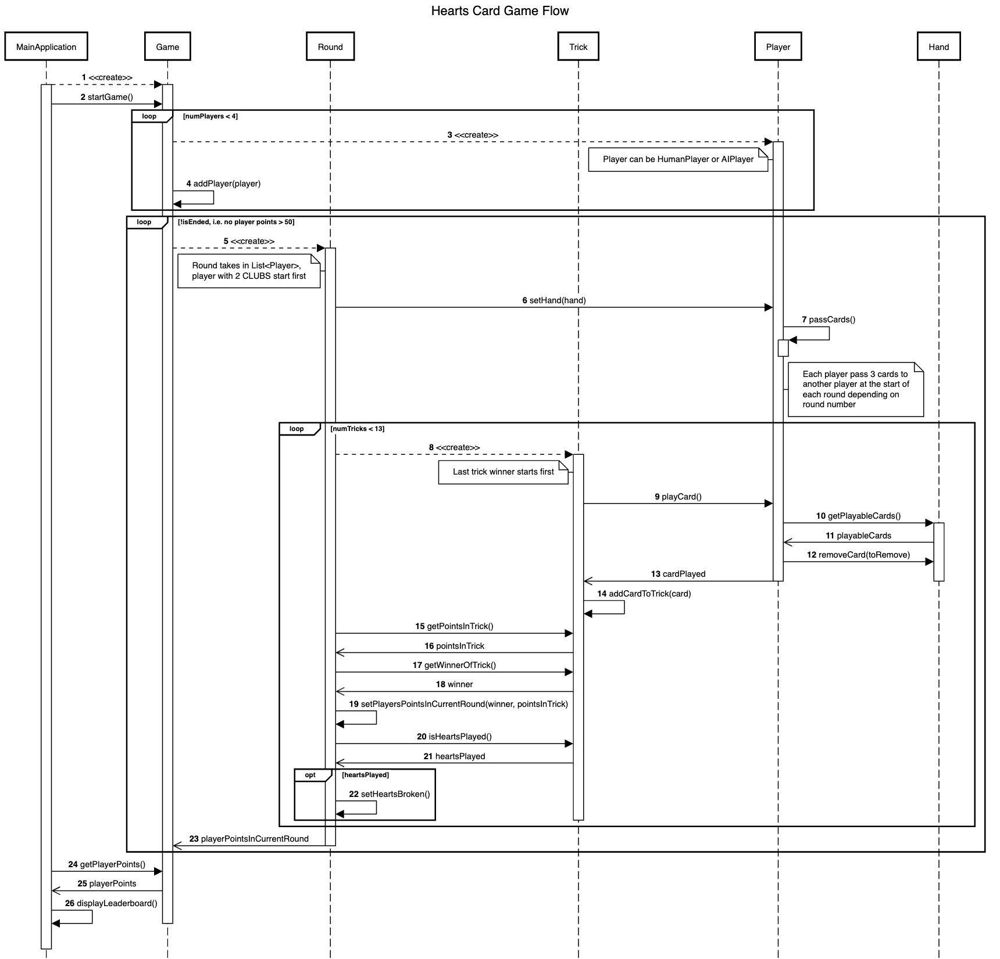

# Hearts Card Game (G2T5)


Our Java project revolves around bringing the beloved card game "Hearts" to life digitally. In Hearts, players strive to avoid collecting specific cards like hearts and the queen of spades while maneuvering to offload them onto opponents. This game offers a mix of strategy, anticipation, and luck, making it a timeless favorite among players. By embarking on this project, we aim to delve into the intricacies of game logic and user interface design, all in an effort to recreate the joy and challenge of playing Hearts in a virtual environment.

---

## Group Members
1. Vince Tan Yueh Yang
2. Jayden Teoh Jing Xiang
3. Lim Jing Kai Joel
4. Philip Leong Jun Hwa
5. Wu Yekai

---

## Rules of Hearts
Please refer to this [link](https://www.thesprucecrafts.com/hearts-complete-card-game-rules-411730) to understand how Hearts is played, it can be abit complex but we trust that you will get it with ease!

---

## How to Run App:
1. Change directory to "JavaFX-UI/Hearts-102"
```
cd JavaFX-UI/Hearts-102
```
2. Compile the Java Code:  
```
bash jfxcompile.bat
```
3. Run the Game:
```
bash jfxrun.bat
```

---

## Sequence Diagram
For simple reference, we have visualize the graphical reprsentation of the interactions between classes using a sequence diagram. Note that interactions from the frontend has been excluded for clarity.


---

## UML
We also incorporated our UML below to aid in understanding our system architecture (classes, dependencies, inheritance etc.). Similar, details about the frontend has been abstracted for clarity.
